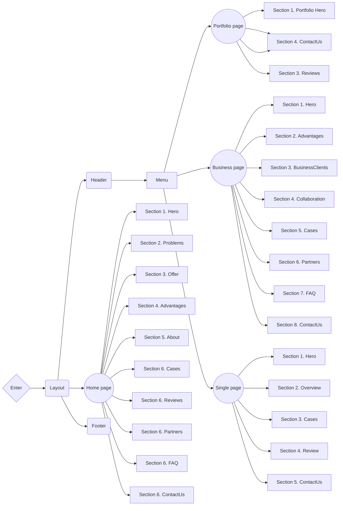

# LAOOI 💻🧩👨🏿‍💻

**[View live page](https://laooi.vercel.app/)**

---


## 🗂️ Project description 🗂️

The website **LAOOI** of the Luhansk Association of Disabled People's
Organizations, which supports people with disabilities, advocates for equal
opportunities, promotes social integration, and improves accessibility and
skills development in eastern Ukraine.

- **Project name**: LAOOI
- **Project goals**: • Offering social support for individuals with
  disabilities. • Advocating for and protecting the rights of people with
  disabilities. • Promoting social integration and inclusion. • Developing
  accessible infrastructure. • Raising public awareness about disability issues.
  • Supporting professional skill development. • Encouraging active
  participation of people with disabilities in various activities.
- **Target audience**:
  - **Age**: All
  - **Gender**: All
- **Product scope**: The Luhansk Association of Disabled Persons’ Organizations
  focuses on providing comprehensive support services for people with
  disabilities, aiming to enhance their quality of life and ensure equal
  opportunities. Key areas include advocacy for disability rights, social
  support programs, professional skills development, and public education on
  disability issues. The organization prioritizes the development of accessible
  infrastructure and active social integration, targeting individuals with
  disabilities primarily in eastern Ukraine. Through these efforts, the
  association strives to foster an inclusive society where people with
  disabilities can fully participate and thrive.

## ⚙️ Creating the project ⚙️

**LAOOI** is a [Next.js](https://nextjs.org/) project bootstrapped with
[`create-next-app`](https://github.com/vercel/next.js/tree/canary/packages/create-next-app).

### Features

- **Optimization**: The website is optimized for fast loading, providing users
  with quick access to information.
- **Modularity and reusability**: The product is built using a component
  approach, which makes the code modular and allows components to be used on
  different pages and in different sections of the project. This simplifies the
  maintenance of the site and the expansion of its functionality.
- **Linters and formatting**: Using tools like Prettier and ESLint helps
  maintain code standards, ensures a consistent style, and identifies potential
  problems in the code.
- **Adaptability**: The website is responsive, allowing you to create dynamic
  and interactive user interfaces without reloading pages. This increases user
  engagement and interaction.
- **Convenient content management**: The content management system has an
  intuitive interface that simplifies the process of updating and editing
  content. You can easily make changes to texts, images and other content
  without special knowledge in web development.
- **Accessibility**:
  - Intuitive design
  - Semantic HTML
  - Mobile-friendly interface
  - Web resource available for any internet connection

### Design

[Design layout on Figma](https://www.figma.com/design/v3lhwJRtxWSqhLP4KkTNgk/Сайт-для-ЛАООІ?node-id=2-10&t=tTa3RbrP3hQlmQOc-1)

### Project structure



<details>

<summary><b>Project Organization and File Colocation: </b></summary>

<br/>

```

|-- public -> static files
|-- src -> source directory with the main application code
  |-- actions -> asynchronous functions that are executed on the server
  |-- app -> pages and routing
    |-- / --> routing group for main UI
    |-- (portfolio) --> routing group for portfolio UI
    |-- (business) --> routing group for business UI
    |-- (single-page) --> routing group for dynamic page UI
  |-- components -> folder with reusable components
    |-- base -> base sections/block components (accordion, form, slider, etc.)
    |-- ui -> small reusable components (button, modal, etc.)
      |-- NameComponent -> folders for each component
        |-- NameComponent.tsx -> main component
        |-- NameComponent.module.css -> file for special components styles
        |-- index.ts -> file for re-export
        |-- types.ts -> file for special components types (props)
  |-- layout -> components that are used as a main template (header, footer)
  |-- sections -> folder with section components
  |-- data -> static data for the project (json)
  |-- types -> folder with reusable type definitions
  |-- utils -> additional reusable functions

```

</details>

### Components API

Each component has its own API. You can find it in the component's folder. This
is a list of more common components and their API.

<details>

<summary><b>Base sections/block components (accordion, form, slider, etc.): </b></summary>

<br/>

- #### ButtonLink

A button component styled as a button but capable of rendering either as a
button or a link, depending on the settings.

| Prop        | Default     | Description                                                                                                                                               |
| ----------- | ----------- | --------------------------------------------------------------------------------------------------------------------------------------------------------- |
| `children`  | `undefined` | required, Built-in ReactNode components, an button content                                                                                                |
| `typeStyle` | `primary`   | optional, can take the value `primary` `secondary` `light` `transparent`, changes the design of the button                                                |
| `icon`      | `true`      | optional, `boolean`, display arrow icon                                                                                                                   |
| `type`      | `undefined` | required, `link` or `button`, Specifies which tag to render                                                                                               |
| `settings`  | `undefined` | required, `Object`, Settings for link `{href: required string, external: required string}` or button `{action: required function}` depending on prop type |
| `className` | `undefined` | optional, `string`, adds custom css class to the Button component.                                                                                        |

- #### CircleButton

A circular button component designed to display content within a round button
and handle click actions.

| Prop        | Default     | Description                                                                                      |
| ----------- | ----------- | ------------------------------------------------------------------------------------------------ |
| `children`  | `undefined` | required, `ReactNode`, defines the content inside the button                                     |
| `action`    | `undefined` | required, `() => void`, function triggered when the button is clicked                            |
| `className` | `undefined` | optional, `string`, adds a custom CSS class to the CircleButton component for additional styling |

- #### Title

A versatile title component that renders a styled heading (`h1`, `h2`, etc.)
with customizable styles based on provided props.

| Prop        | Default     | Description                                                                                                                                   |
| ----------- | ----------- | --------------------------------------------------------------------------------------------------------------------------------------------- |
| `children`  | `undefined` | required, `ReactNode`, content displayed inside the title                                                                                     |
| `tag`       | `h2`        | optional, `string`, specifies the HTML tag to render as (`h1`, `h2`, `h3`, etc.)                                                              |
| `style`     | `second`    | optional, can take values `main`, `second`, or `third`, each representing different text styles for the title                                 |
| `className` | `undefined` | optional, `string`, adds custom CSS classes for additional styling on the title component                                                     |
| `hidden`    | `false`     | optional, `boolean`, if `true`, applies the `visually-hidden` class to hide the title visually while keeping it accessible for screen readers |

- #### DropdownMenu

The component is a drop-down menu that can contain button or link elements.

| Prop             | Default        | Description                                                                             |
| ---------------- | -------------- | --------------------------------------------------------------------------------------- |
| `children`       | `undefined`    | required, `ReactNode`, accepts a button component that will open a menu when clicked    |
| `dataForButtons` | `undefined`    | optional, `Array`, array of objects with settings and data of menu button elements      |
| `dataForLinks`   | `undefined`    | optional, `Array`, array of objects with settings and data of menu link items           |
| `menuPosition`   | `bottom start` | optional, `string`, a line with a list of pages from which the menu location is counted |

- #### AccessMenu

The component is a drop-down menu that contains buttons for controlling text
magnification, using grayscale, and underlining links throughout the site.

| Prop   | Default     | Description                                                    |
| ------ | ----------- | -------------------------------------------------------------- |
| `dict` | `undefined` | required, `IDictionary`, data stored in the project dictionary |

- #### Logo

Company Logo component, the logo image is wrapped in a link that leads to the
main page of the site

| Prop      | Default     | Description                                                            |
| --------- | ----------- | ---------------------------------------------------------------------- |
| `lang`    | `undefined` | required, `string`, current site language                              |
| `logoAlt` | `undefined` | required, `string`, static data, description of the company logo image |

- #### LangSwitcher

A component that displays the current site language and provides the ability to
change languages ​​to Ukrainian or English

| Prop       | Default     | Description                                    |
| ---------- | ----------- | ---------------------------------------------- |
| `lang`     | `undefined` | required, `string`, current site language      |
| `langCode` | `undefined` | required, `string`, static data, language code |

- #### SearchInput

A component for entering search queries on a website. It has a separate state
for desktop devices, a button that appears when clicked.

| Prop          | Default     | Description                                                      |
| ------------- | ----------- | ---------------------------------------------------------------- |
| `placeholder` | `undefined` | required, `string`, placeholder                                  |
| `desktop`     | `undefined` | optional, `boolean` or `undefined`, enables desktop version mode |

- #### Accordion

A component that renders a list of collapsible accordion items, allowing users
to expand or collapse content sections.

| Prop   | Default     | Description                                                                                                                     |
| ------ | ----------- | ------------------------------------------------------------------------------------------------------------------------------- |
| `data` | `undefined` | required, `Array<{ title: string; text: string }>` - an array of objects containing `title` and `text` for each accordion item. |

- #### AccordionItem

A component that represents an individual item in an accordion. It displays a
title and collapsible content, with an arrow icon indicating the open/close
default first item.

| Prop          | Default     | Description                                                                                                    |
| ------------- | ----------- | -------------------------------------------------------------------------------------------------------------- |
| `item`        | `undefined` | required, `{ title: string; text: string }`, an object containing the `title` and `text` content for the item. |
| `defaultOpen` | `false`     | optional, `boolean`, determines whether the accordion item is open by default.                                 |

</details>

### 🚧 Technology stack

- **Main technologies**:

  - Next.js (app router)
  - TypeScript
  - Tailwind CSS

- **Additional dependencies**:

  - Headless UI
  - Swiper
  - React Player
  - React Hook Form
  - React Hook Form Persist
  - React Number Format
  - Zod
  - Clsx
  - Googleapis
  - Graphql-request
  - Graphql

  ...full list of dependencies is available in `package.json` file.

## 🗃️ Deployment 🗃️

To deploy this project, you need to perform the following steps:

1. **Clone the repository**: Use the `git clone` command to clone this
   repository to your computer.
2. **Install the dependencies**: Open a terminal in the root of the project and
   run `npm install` or `yarn install` to install all required dependencies.
3. **Setting environment variables**: Create a `.env` file in the root folder
   and add the necessary environment variables that you need for the project
   according to the `.env.example` file.
4. **Run the application**: Run the `npm run dev` or `yarn dev` command to run
   the project on the local server.
5. **Deploy**: To deploy this project to a production server, use hosting
   platforms such as Vercel, Netlify, or others.

## 📱 Contacts 📱

**WDS** is ready to answer your questions and provide additional information:

- **Website**: [webdevsynergy.com.ua](https://www.webdevsynergy.com.ua)
- **Phone**: <a href="tel:+380665762413">+380665762413</a>
- **Email**: [wds.webdevsynergy@gmail.com](mailto:wds.webdevsynergy@gmail.com)
